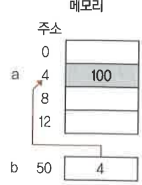

<h1>포인터</h1>

1. 포인터

- 주소를 나타내는 자료
- ex)
```
int* a; //a라는 int형 포인터 변수
```
<hr>
2. 포인터 연산자

- \& : 참조(Referencing) 연산자, 대상의 주소를 얻어 오는 연산자
- ex)
```
 a= &b;
 ```
- \*  : 역참조 연산자. 주소로부터 대상 변수값을  얻어오는 연산자
- ex)
``` 
int c =*a;
```
* 포인터 변수는 힙 영역 에 접근하는 동적 변수


```
int a=100; // a의 주소는 4이다.
int*   b; //int형 자료의 주소를 기억하는 포인터 변수
b= &a; //포인터 변수 b 는 변수 a 의 주소 4를 기억
printf("%d", *b); 
```
<hr>
3. 메모리 영역

<hr>
<h1>포인터와 배열</h1>

- 포인터를 이용하여 배열의 요소에 접근 가능
```
  int a[5];
  int*  b;
  b = a;    // 배열 a의 시작 주소인 a[0] 의 주소를 포인터 변수 b에 저장
```