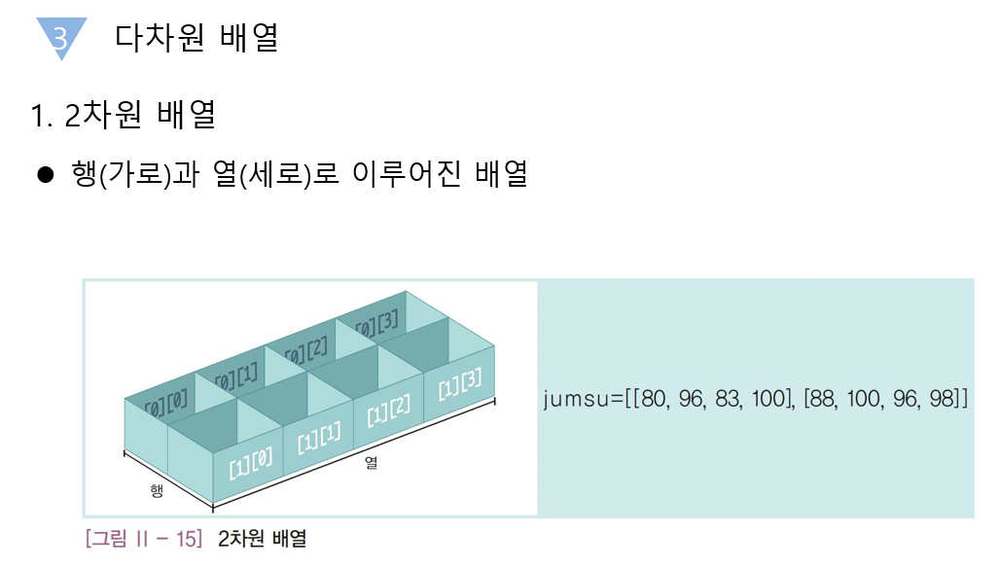

<h1>2차원 배열</h1>

- 행과 열로 이루어진 배열


1. 2차원 배열의 선언
 - 자료형, 배열 이름, 배열 길이 순으로 선언
 - ex)
 ```
int array[3][4];
 ```

 2. 배열의 초기화


ex)
```
#include <stdio.h>
void inputArray( int a[][4], int row );
int score[3][4];
int main(){
	int i, j;
	int tot;
	double avg;
	//printf("학생 3명, 각각 네 과목의 점수를 입력하세요\n");
	inputArray( score, 3);
	//각 학생의 총점과 평균을 계산하여 출력
	for(i=0; i<3; i++){
		tot = 0;
		for(j=0; j<4; j++){
			tot += score[i][j];
		}
		avg = tot /4.;
		printf("총점 : %d, 평균 : %.2lf\n",tot,avg);
	}

	return 0;
}
void inputArray( int a[][4], int row ){
	int i, j; 
	//각 학생의 점수를 row 번 입력받기
	for(i=0; i<row; i++){
		for(j=0; j<4; j++){
			scanf("%d", &score[i][j]);
		}
	}
}
//입력 : 5 4 5 6  8 7 8 9  9 10 11 10
//출력 :
//    총점 : 20, 평균 : 5.00
//    총점 : 32, 평균 : 8.00
//    총점 : 40, 평균 : 10.00
```