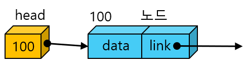
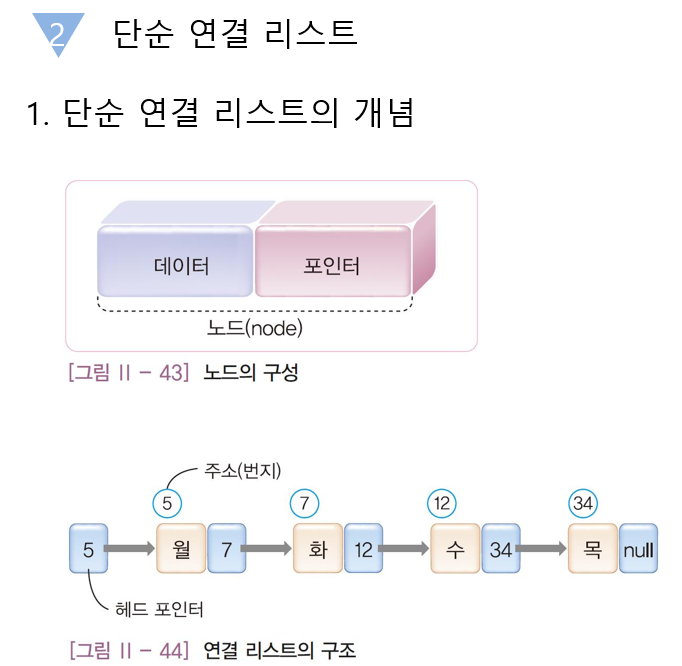

<h1>연결리스트</h1>

1. 연결 리스트와 배열

 - 1) 삽입/삭제시 수행 속도
    - 연결리스트: 속도 비교적 빠름.
    - 배열: 비교적 느림. (주소를 알면 빠름)
 
 - 2) 탐색시 수행 속도
    - 연결리스트: 속도 비교적 느림.
    - 배열: 비교적 빠름.

2. 단순 연결리스트 ADT


 구조체 정의
 ```
 typedef struct Node{
	element data;
	struct Node* next;
}Node;
 ```